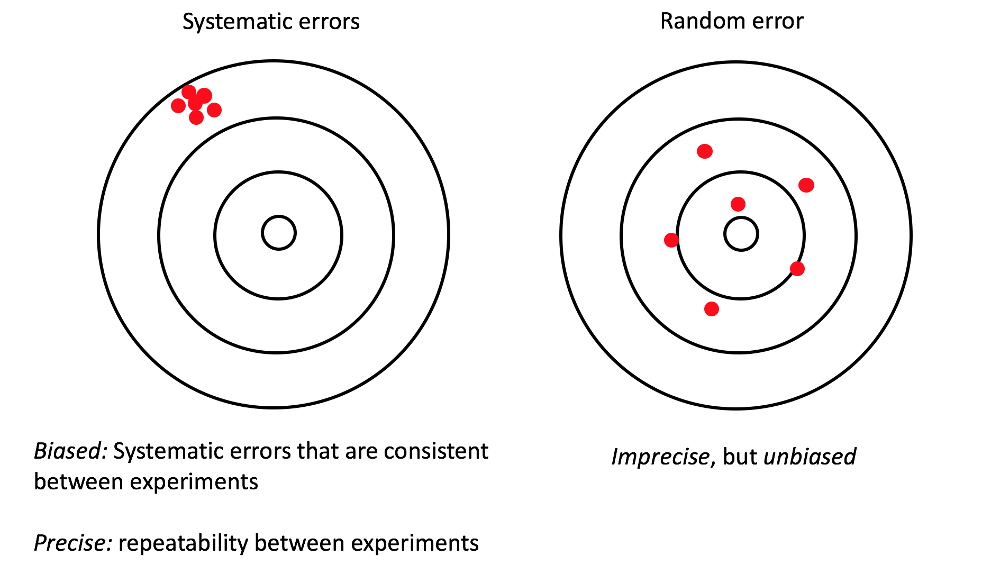
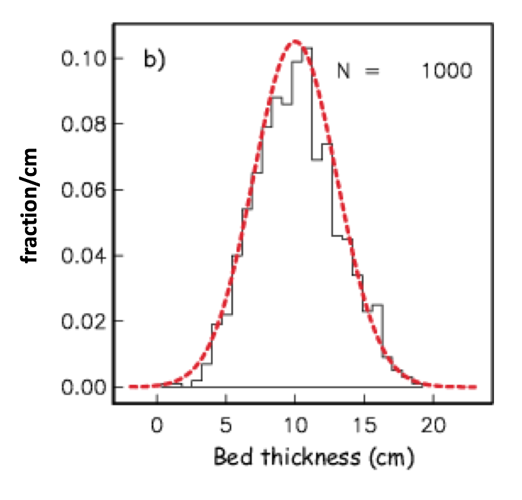

### Introductions ###
	Sean - BioOce lab - Flow cytometry lab
	Bri - Vert Lab - Marine Mammal acustics
	Alan - Geooce Lab - Core samples
	Holly - BioOce - Counting cells, flow cytometry
	Tim - HMS - Remote sensing, CTD timeseries
	Steve - Phycology -  ADP (Acoustic Doppler Profile) data, plotting

Course Websites 
<b>Moodle</b>
- Readings
- Lectures
- Discussion forum

<b>Github</b> 
[github.com/mlmldata2017](github.com/mlmldata2017)

Homework will be weekly

Final Project
format:
	Jupyter notebook
		Code, text, images
		Open ended, but using data that is interesting or related to your thesis project.

Tom's Office Hours: Mondays 1-4pm, Wednesdays 1-4pm  
Patrick's Office hours: Tuesday 4-5pm, Thursdays 1-4pm

### Types of Data ###
__Discrete__ - represented by an integer (whole number)- counts, presence/absence  
__Continuous__ - represented by read numbers (floating point) temperature 
__Categorical__ - hair color, locations (sites) 
__Metadata__ - "data about data"

### Types of Measurements ###
__Nominal__ - categories of equal rank 
__Ordinal__ - Categories have a logically defined rank 
__Scale__: __interval__ and __Ratio__
- Size Categories, Steps not necessarily equal or quantifiable 
	examples:
	How sediment grains are categorized, x-axis: angularity vs y-axis: sphericity
	Hurricane scale: ranking is not equivalent to strength 
	Beufort Wind Scale: Mariner estimate of wind from wave climate, logically defined, but not quantifiable

	__interval scale__: temperature scale  
	__ratio scale__: natural zero point
	ex: length, mass

### Types of Error ###
__Systematic error__  - systematically repeatable biased  
__Random error__ - Impercise, but unbiased

__Measurement precision__ 
You would record a value from a ruler to 3.7567453 cm if your ruler only has mm hash marks

Rounding introduces error into your calculations, so in general it is better to use all of the digits that you have and round off to the significant digit when reporting the value

__Drift__ - a systematical error that changes over time

Johnson and Coletti (2002)

Bottle data (squares): chemically derived values of nitrate (low resolution, high precision) 
ISUS Nitrate Sensor (High resolution, systematic error (underreported values compared to bottle casts) , instrument noise (small scale random error))

Smoothing of to remove noise (lowers resolution) 
Temperature Bias correction

__Normal Distribution__

[source](https://earthref.org/MagIC/books/Tauxe/Essentials/WebBook3ch11.html) 
Bars: Fraction of samples that occur in each range, per bed thickness, normalized

Black Line:Probability density = fraction/Δx (Real line) 
Redline: Normal distribution (hypothetical), allows the use of mathematical theories to use statistics  

Integral of area under the curve = 1 (all probability falls under the curve)

[Wikipedia](https://en.wikipedia.org/wiki/Normal_distribution#/media/File:Empirical_Rule.PNG)
